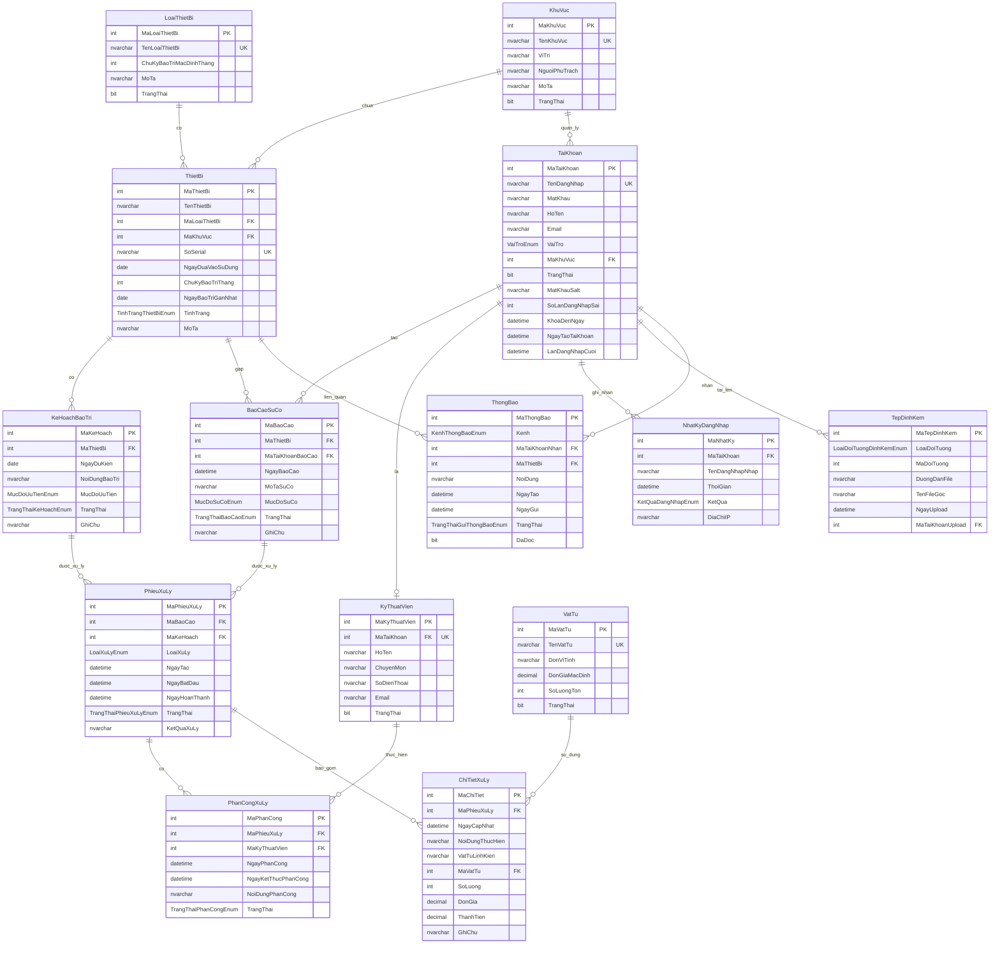

```mermaid
erDiagram
    %% QUAN HE CAC BANG
    LoaiThietBi ||--o{ ThietBi : "co"
    KhuVuc ||--o{ ThietBi : "chua"
    KhuVuc ||--o{ TaiKhoan : "quan_ly"
    ThietBi ||--o{ KeHoachBaoTri : "co"
    ThietBi ||--o{ BaoCaoSuCo : "gap"
    TaiKhoan ||--o{ BaoCaoSuCo : "tao"
    TaiKhoan ||--o| KyThuatVien : "la"
    BaoCaoSuCo ||--o{ PhieuXuLy : "duoc_xu_ly"
    KeHoachBaoTri ||--o{ PhieuXuLy : "duoc_xu_ly"
    PhieuXuLy ||--o{ PhanCongXuLy : "co"
    KyThuatVien ||--o{ PhanCongXuLy : "thuc_hien"
    PhieuXuLy ||--o{ ChiTietXuLy : "bao_gom"
    TaiKhoan ||--o{ NhatKyDangNhap : "ghi_nhan"
    VatTu ||--o{ ChiTietXuLy : "su_dung"
    TaiKhoan ||--o{ TepDinhKem : "tai_len"
    TaiKhoan ||--o{ ThongBao : "nhan"
    ThietBi ||--o{ ThongBao : "lien_quan"

    %% CHI TIET CAC BANG
    TaiKhoan {
        int MaTaiKhoan PK
        nvarchar TenDangNhap "UK"
        nvarchar MatKhau
        nvarchar HoTen
        nvarchar Email
        VaiTroEnum VaiTro
        int MaKhuVuc FK
        bit TrangThai
        nvarchar MatKhauSalt
        int SoLanDangNhapSai
        datetime KhoaDenNgay
        datetime NgayTaoTaiKhoan
        datetime LanDangNhapCuoi
    }

    NhatKyDangNhap {
        int MaNhatKy PK
        int MaTaiKhoan FK
        nvarchar TenDangNhapNhap
        datetime ThoiGian
        KetQuaDangNhapEnum KetQua
        nvarchar DiaChiIP
    }

    LoaiThietBi {
        int MaLoaiThietBi PK
        nvarchar TenLoaiThietBi "UK"
        int ChuKyBaoTriMacDinhThang
        nvarchar MoTa
        bit TrangThai
    }

    KhuVuc {
        int MaKhuVuc PK
        nvarchar TenKhuVuc "UK"
        nvarchar ViTri
        nvarchar NguoiPhuTrach
        nvarchar MoTa
        bit TrangThai
    }

    ThietBi {
        int MaThietBi PK
        nvarchar TenThietBi
        int MaLoaiThietBi FK
        int MaKhuVuc FK
        nvarchar SoSerial "UK"
        date NgayDuaVaoSuDung
        int ChuKyBaoTriThang
        date NgayBaoTriGanNhat
        TinhTrangThietBiEnum TinhTrang
        nvarchar MoTa
    }

    KeHoachBaoTri {
        int MaKeHoach PK
        int MaThietBi FK
        date NgayDuKien
        nvarchar NoiDungBaoTri
        MucDoUuTienEnum MucDoUuTien
        TrangThaiKeHoachEnum TrangThai
        nvarchar GhiChu
    }

    BaoCaoSuCo {
        int MaBaoCao PK
        int MaThietBi FK
        int MaTaiKhoanBaoCao FK
        datetime NgayBaoCao
        nvarchar MoTaSuCo
        MucDoSuCoEnum MucDoSuCo
        TrangThaiBaoCaoEnum TrangThai
        nvarchar GhiChu
    }

    KyThuatVien {
        int MaKyThuatVien PK
        int MaTaiKhoan FK "UK"
        nvarchar HoTen
        nvarchar ChuyenMon
        nvarchar SoDienThoai
        nvarchar Email
        bit TrangThai
    }

    PhieuXuLy {
        int MaPhieuXuLy PK
        int MaBaoCao FK
        int MaKeHoach FK
        LoaiXuLyEnum LoaiXuLy
        datetime NgayTao
        datetime NgayBatDau
        datetime NgayHoanThanh
        TrangThaiPhieuXuLyEnum TrangThai
        nvarchar KetQuaXuLy
    }

    PhanCongXuLy {
        int MaPhanCong PK
        int MaPhieuXuLy FK
        int MaKyThuatVien FK
        datetime NgayPhanCong
        datetime NgayKetThucPhanCong
        nvarchar NoiDungPhanCong
        TrangThaiPhanCongEnum TrangThai
    }

    VatTu {
        int MaVatTu PK
        nvarchar TenVatTu "UK"
        nvarchar DonViTinh
        decimal DonGiaMacDinh
        int SoLuongTon
        bit TrangThai
    }

    ChiTietXuLy {
        int MaChiTiet PK
        int MaPhieuXuLy FK
        datetime NgayCapNhat
        nvarchar NoiDungThucHien
        nvarchar VatTuLinhKien
        int MaVatTu FK
        int SoLuong
        decimal DonGia
        decimal ThanhTien
        nvarchar GhiChu
    }

    TepDinhKem {
        int MaTepDinhKem PK
        LoaiDoiTuongDinhKemEnum LoaiDoiTuong
        int MaDoiTuong
        nvarchar DuongDanFile
        nvarchar TenFileGoc
        datetime NgayUpload
        int MaTaiKhoanUpload FK
    }

    ThongBao {
        int MaThongBao PK
        KenhThongBaoEnum Kenh
        int MaTaiKhoanNhan FK
        int MaThietBi FK
        nvarchar NoiDung
        datetime NgayTao
        datetime NgayGui
        TrangThaiGuiThongBaoEnum TrangThai
        bit DaDoc
    }
```
